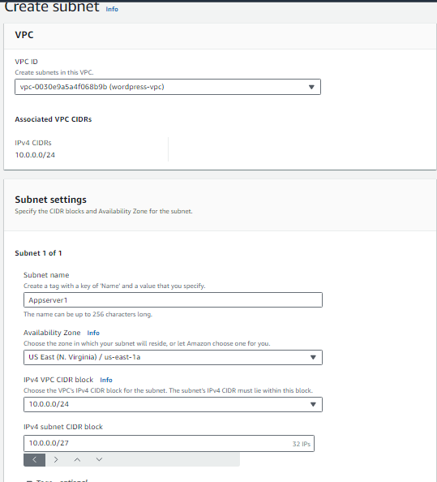
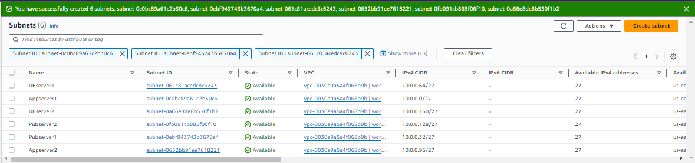

**Create subnets in the new VPC:**

The next step is to create subnets across two availability zones (AZ).
There will be six subnets in total, three for each AZ. The first pair of
subnets (*Pubserver1* and *Pubserver2*) will be public and accessible
from the internet. The second pair (*Appserver1* and *Appserver2*), and
third pair (*DBserver1* and *DBserver2*) will be private subnets.

To create the six subnets, select *\'subnets\'* on the left panel of
your VPC console and click *\'create subnet\'*. Define the
characteristics of each subnet and make sure to always select the VPC
you just created in this exercise.

For each subnet, specify a name and CIDR range for the subnet. Be sure
to create a '*Pubserver'*, '*Appserver'* and '*DBserver'* subnet in each
of the two availability zones (you can visit ***www***.***site24x7***.***com*** for your subnet-CIDR calculation).

