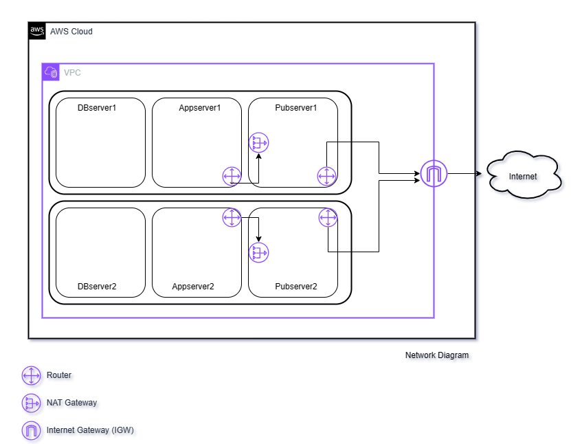

**c. Make the VPC accessible from the internet:**

We will need to grant internet access to any EC2 instance deployed in
our VPC. To do this, visit the VPC console and from the left panel
select and create a new internet gateway (IGW) and attach it to our VPC.
Then create a new route table with a default route (i.e. 0.0.0.0/0)
pointing to the IGW and attach the route table to each of the
'*Pubserver'* subnets (this gives the '*Pubserver'* subnets public
access to the internet). Next, from the VPC console select '*NAT
gateway'* and create one gateway in each of the two '*Pubserver'*
subnets. Create a new route table for each of the '*Appserver'* subnets
with a default route pointing to the NAT gateway (this will give the
'*Appserver'* subnets a one-way secure internet access).

Note: Make sure to delete the NAT gateways and their associated elastic
IP's immediately after this exercise to avoid excess charges. Although
recommended in-production, you can optionally exclude the NAT gateways
for this exercise by making your '*Appserver*' subnets public*.*
