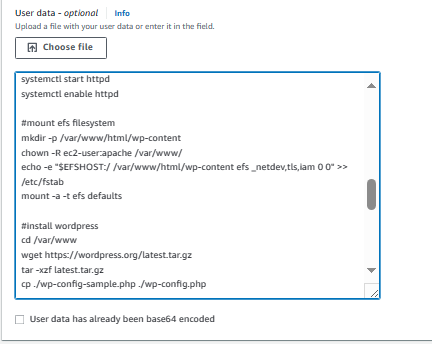

**Create the ASG instance launch template:**

At this point we should have all our resources and parameters ready; we can now create the launch template to be used by the autoscaling group. Navigate to the EC2 console, select *'launch template'* from the left panel and click *'create launch template'*. Specify a name and description for your launch template and include other details i.e. 'AMI' to be used (preferably Amazon Linux 2 HVM), instance type (free-tier eligible) and security groups. You may skip 'subnet info' and proceed without keypair. Under security group, do not forget to select all the non-associated security groups created in the previous Tasks i.e*. 'databaserdssg2'*, *'wpefssg2'* and *'loadbalancersg2*'. Expand *'advanced details'* from *'additional configuration'*, select the IAM instance profile you created earlier and paste the script below into the *‘user data’* field.

Under summary, click *'create launch template'.*

***Note***: _To avoid any errors during script execution, you need to have ‘Root permissions'. Alternatively, you can adjust file permissions using the ‘chmod’ command and execute with ‘sudo’ privileges_.
