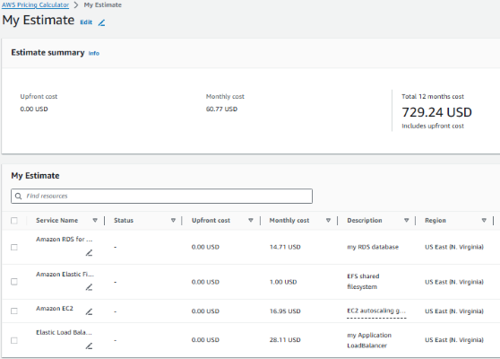

**Create and configure an estimate:**

Visit the Pricing Calculator console page and click *'create estimate'*. We will configure the Pricing Calculator with all the resources associated with our WordPress application. From the 'Add service' page, select *'search by location type*' and choose the region where your application is deployed i.e. *us-east-1*. Next, find and configure your first service.

Populate the entry fields with the parameters that best defines your deployment needs and click *'save and add service’.* Repeat this process for all the services associated with our WordPress application i.e. *RDS, EFS, EC2* and *ELB*. When completed, click *'save and view summary'* to see your estimated deployment cost.

***Note***: _You can also include your networking components if you desire i.e., Nat gateway, IGW, etc_.  

Take note of the monthly cost estimate, it will serve as a reference guide when we create our AWS cost budget.

